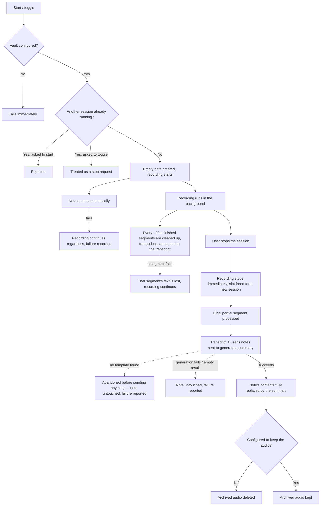
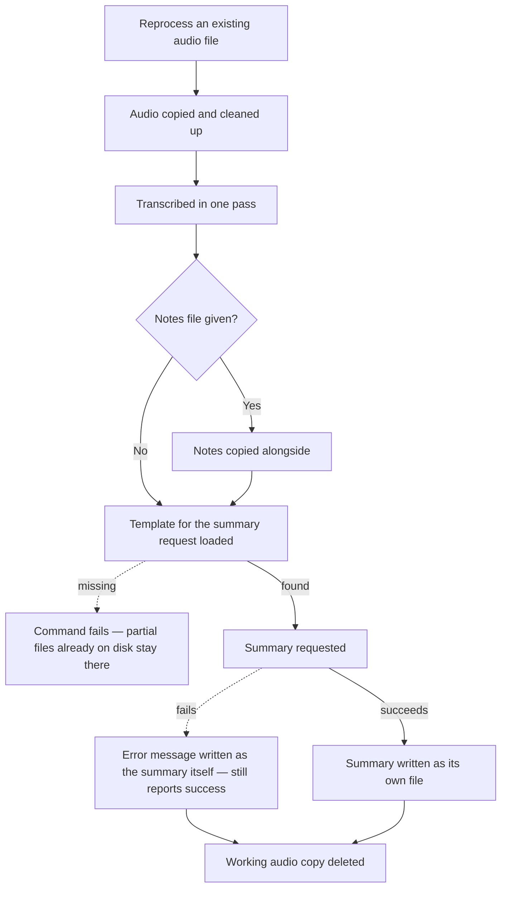

# Behavior

This document describes what trani actually does, step by step, and what happens when things go wrong — independent of how any of it is implemented. It does not name tools, code, or file internals; see the ADRs and the codebase itself for that.

There are two completely separate flows. They never share state, and a problem in one has no effect on the other.

1. **Live session** — record a meeting or dictation from scratch, with a note open in Obsidian the whole time.
2. **Standalone reprocessing** — turn an already-existing audio file (recorded some other way) into a transcript and summary.

## 1. Live session

### Starting

- A vault must be configured beforehand. If it isn't, nothing starts — the command fails immediately, before anything is created or recorded.
- Only one session can be active at a time. Trying to start a second one while one is already running is rejected outright. Asking to "toggle" while one is already running is instead treated as a request to stop it (see below).
- Once a session is allowed to start, the command that started it returns immediately — everything described next happens on its own, without blocking whatever the user does next.
- A new, empty note is created, named after the current date and time.
- Recording begins right away: the microphone, and optionally the computer's own audio output (for capturing both sides of a call), are captured as independent streams, continuously and without gaps.
- The note is opened automatically. If that fails for any reason (the note-taking app isn't running, isn't pointed at the right vault, etc.), the recording is completely unaffected — it just keeps going in the background, and the failure is recorded for later (see [Error visibility](#error-visibility)).

### While recording

- The recording is continuously split into short, fixed-length segments as it goes, with no gap or restart between them.
- Roughly every 20 seconds, any segment that has finished gets cleaned up (volume normalized, background noise filtered) and transcribed, and its text is appended to the session's running transcript. If both the microphone and system audio are being captured, they're either merged into a single recording before transcribing, or transcribed separately and stitched together afterward, depending on configuration.
- If an individual segment fails to process, only that segment's text is lost — the rest of the recording and the session as a whole are unaffected. This particular kind of failure is not currently recorded anywhere durable; it's the one gap in the failure-visibility story below.
- Because segments are handled as they close, most of the transcription work is already finished by the time the user stops the session, rather than all happening afterward.

### Stopping

- Triggered explicitly, or by toggling a second time.
- Recording stops immediately, and the session is instantly considered free — a new session can be started right away, even before this one has finished generating its summary.
- Whatever partial segment was still being recorded when the stop happened is processed the same way as any other segment.
- Everything from this point (turning the accumulated transcript into a summary) continues on its own, decoupled from the stop command itself.

### Generating the summary

- The accumulated transcript (with immediate repeated lines removed, a known artifact of transcription) is combined with whatever the user actually typed into the note while it was open, and this combination is sent off to generate a structured summary.
- If no template for building that request can be found at all (neither the one asked for, nor the standard fallback), nothing is sent anywhere — the attempt is abandoned before it starts, the note is left exactly as the user left it, and the failure is reported.
- If generating the summary fails for any other reason, or comes back empty, the note is again left completely untouched, and the failure is reported. A summary is never partially applied.
- If it succeeds, the note's entire contents are replaced by the generated summary. There is no separate copy of the user's raw notes kept anywhere — once the summary lands, the note *is* the summary.
- After that, the archived raw audio for the session is deleted, unless the configuration says to keep it.
- A final notification reports whether the session finished successfully or failed.

## 2. Standalone reprocessing

This is a one-shot, run-to-completion command: it doesn't return until it's entirely done, and it never touches the vault, the "one active session" restriction, or anything from the flow above.

- Takes an already-recorded audio file, and optionally a separate file of notes.
- Makes its own working copy of the audio, cleans it up, and transcribes it in a single pass — there's no progressive, while-it's-happening processing here, since there's no live recording to progress through.
- Produces its own dedicated output location containing three separate files: the full transcript, a copy of the notes (if any were given), and the summary. This is different from the live session's single-note convention above.
- If no template can be found to build the summary request, the whole command fails outright — but only *after* the audio has already been copied, processed, and transcribed to disk. Those partial results are not cleaned up when this happens.
- If generating the summary itself fails, the command does **not** fail: the error message is written into the summary file in place of an actual summary, and the command still reports success.
- The working copy of the audio this command makes for itself is always deleted once it's done — there's no "keep the audio" setting for this flow the way there is for live sessions.

## Error visibility

Failures during a live session run in the background, with no window a user is watching. Two layers exist to surface them anyway:

- A brief on-screen notification appears for most failures — but it disappears on its own, so it's easy to miss if you're not looking right when it happens.
- Most of the same failures are also written to a small, permanent record kept alongside trani's configuration, independent of any single run of the app. Each entry records when it happened, a short label for which part of the process failed, which session it belongs to (when known), and a description of the failure — meant to be checked after the fact, once the notification is long gone.

Not every failure reaches that permanent record yet: a single audio segment failing to process mid-recording currently only shows up as a fleeting notice, if that.

## Concurrency and timing notes

- Two live sessions can never run at once — starting one always checks that no other is already active.
- A session's recording and its summary generation are independent of each other: the moment recording stops, a brand-new session is free to start, even while the previous one's summary is still being worked on.
- There's a brief window, right as a session is stopping, where an immediate second toggle can be absorbed as just another stop request instead of starting something new. Trying again a moment later behaves normally.
